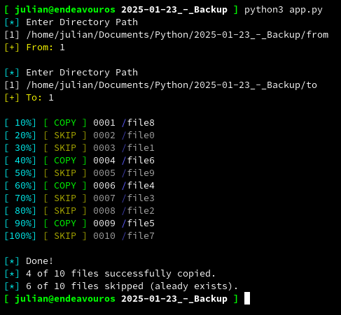

# BackupCLI

## Screenshot

## Description
- With this command line tool written in python, you can copy files from one folder to another.
- After you start the app.py you will be asked for the path, whence you would like to copy from, and the target path where you would like to copy it to.
- You can save the paths if you like. These would be stored in a data.json file, which will be created beside the app.py file.
- When you already have copied the files the program skips them.

## Requirements
- colorama

## Platform
- Linux
